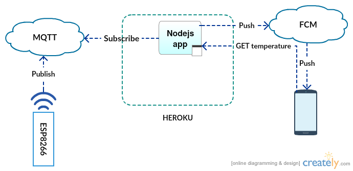
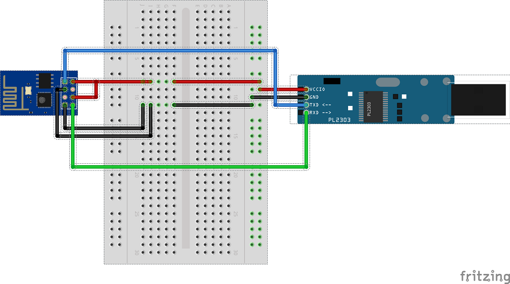
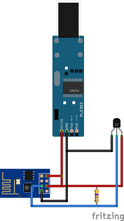
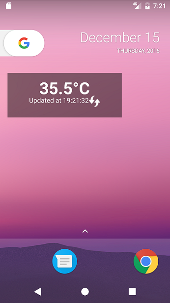
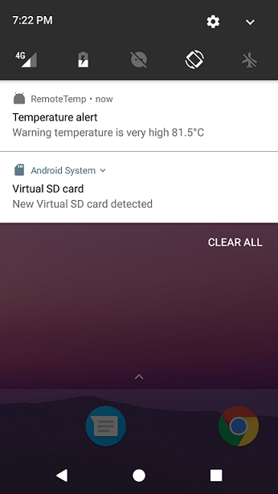

Over the weekend I decided to once and for all resolve issue with boiling water in our central heating system. For people who don't know what I'm writing about here, you will find nice [ilustration](https://www.plumber24hours.co.uk/plumber-blog/index.php/2013/01/05/solid-fuel/) that should make it clear. In my case the problem is that when I focus on something I forgot about the world around me and then after some time the sound of boiling water in pipes immediately pulls me out of my work and in few seconds I'm in the basement trying to resolve issue in different ways and this isn't a pleasant operation. Please notice that this situation is very dangerous because boiling water can damage pipes and in few minutes your home can be flooded and repair costs probably will be very high.
Solution to my issue would be replacing the old furnace with new one that can automatically take care of temperature adjustments, but I have got much more cheaper and more interensting solution for this one. 

<!-- end -->

## Idea

My idea is to use [ESP8266](https://en.wikipedia.org/wiki/ESP8266) that will send temperature readings to [MQTT broker](https://www.cloudmqtt.com/) running in the cloud
and then business logic will be handled by lightweight nodejs application running on [Heroku](https://dashboard.heroku.com/). Logic is simple, display the current temperature in real time one web page using WebSocket protocol, expose REST endpoint with current temperature and send a notification to registered Android devices when the temperature is over 80 Celcius degrees. Registered devices will be stored in MongoDB hosted by [mLab](https://mlab.com/). Here is top level architecture diagram:



## Costs

Only costs I had to bear were for physical devices:
- ESP8266 bought [here](http://allegro.pl/modul-sieciowy-wifi-esp8266-sterowanie-rs232-at-i5506834559.html) for about 4$
- Converter USB UART/RS232 bought [here](http://allegro.pl/konwerter-przejsciowka-usb-uart-rs232-pl2303hx-avr-i5734968614.html) for about 1$
- DS18B20 digital temperature sensor bought [here](http://allegro.pl/czujnik-temperatury-ds18b20-wodoodprony-przewod-1m-i5460123942.html) for about 1,8 $
- Power supply bought [here](http://allegro.pl/ladowarka-zasilacz-usb-5v-2a-kabel-mikrousb-i5903646901.html) 4$

Total: 10,8 $

If it comes to MQTT broker, application and database hosting I'm using free plans as they are sufficient for my needs.

## Implementation

Complete project can be found on [github](https://github.com/ajurasz/RemoteTemperature). In this post, I will only focus on core parts of each component. So what are the components:

- ESP8226 device
- Nodejs application 
- Android application

Regarding [Eclipse IoT White Paper](https://iot.eclipse.org/resources/white-papers/Eclipse%20IoT%20White%20Paper%20-%20The%20Three%20Software%20Stacks%20Required%20for%20IoT%20Architectures.pdf) I would say that in my simple architecture ESP8266 act as both field device and gateway. Nodejs is an application that only performs business logic on data delivered by devices (in my case just one device). Android application is for the end user, where that user can check current temperature and be notified when the temperature is too high. 

### ESP8226

If it comes to ESP8266 there are two main things that you need to know when playing with this device. There are different wirings for deploying and running your program. When you want to deploy your program to the device you need to set up wirings in following way:



when you want to run your program, wirings should be set up in the following way (scheme contains temperature sensor connected to ESP8266):



Main responsibilities of ESP8226 device are:

1) establish and keep a connection to local network (to gain access to the internet) 

```c
#include <ESP8266WiFi.h>

#define wifi_ssid "<your ssid>"
#define wifi_password "<ssid password>"

void setup() {

  WiFi.begin(wifi_ssid, wifi_password);

  while (WiFi.status() != WL_CONNECTED) {
    delay(500);
    Serial.print(".");
  }

  Serial.println("");
  Serial.println("WiFi connected");
  Serial.println("IP address: ");
  Serial.println(WiFi.localIP());
}
```

2) read data from the temperature sensor

```c
#include <OneWire.h>
#include <DallasTemperature.h>

#define ONE_WIRE_BUS 2

OneWire oneWire(ONE_WIRE_BUS);
DallasTemperature sensors(&oneWire);

void setup() {

  sensors.requestTemperatures();
  float tempC = sensors.getTempCByIndex(0);

}
```

3) push readings to MQTT broker

```c
#include <ESP8266WiFi.h>
#include <PubSubClient.h>

#define mqtt_server "<server ip or hostname>"
#define mqtt_port "<server port>"
#define mqtt_user "<user name>"
#define mqtt_password "<user password>"
#define temperature_topic "temperature/home/basement"

WiFiClient espClient;
PubSubClient client(espClient);

void setup() {

  client.setServer(mqtt_server, mqtt_port);

}

void reconnect() {

  while (!client.connected()) {
    Serial.print("Attempting MQTT connection...");
    if (client.connect("ESP8266BasementClient", mqtt_user, mqtt_password)) {
      Serial.println("connected");
    } else {
      Serial.print("failed, rc=");
      Serial.print(client.state());
      Serial.println(" try again in 5 seconds");
      delay(5000);
    }
  }

}

void loop() {

  if (!client.connected()) {
    reconnect(); 
  }
  client.loop();

  client.publish(temperature_topic, "80.0", true);

  // Wait 30 seconds
  delay(30000);

}
```

You can run above snippets independently or combine them together. At this point I need to say that it was so easy only thanks to these great libraries (as I have basically no experience in C language):

[ESP8266WiFi](https://github.com/esp8266/Arduino/tree/master/libraries/ESP8266WiFi)

[PubSubClient](https://github.com/knolleary/pubsubclient)

[DallasTemperature](https://github.com/milesburton/Arduino-Temperature-Control-Library)


### Nodejs

I wanted to have something very light on the back end and to be able to host it for free so I decided to accomplish my requirements using nodejs which will run on Heroku. Another reason to choose Nodejs was that I wanted to check it out as I heard a lot of good about it. 

Main responsibilities of the Nodejs application:

1) expose REST endpoints to handle device registration, update and delete:

```javascript

app.post('/device', function(req, res) {
    var deviceName = req.body.deviceName;
    var deviceId   = req.body.deviceId;
    var registrationId = req.body.registrationId;    

    Device.find({deviceId : deviceId}, function(err, devices) {
        if (err) {
            console.error(err);
            res.sendStatus(500);
        }

        if (devices.length == 0) {
            Device.create({
                deviceName: deviceName,
                deviceId: deviceId,
                registrationId: registrationId
            }, function(err, device) {
                if (err) {
                    console.error(err);
                    res.sendStatus(500);
                }
                res.sendStatus(200);
            });            
        } else {
            res.sendStatus(200);
        }        
    });
});

app.put('/device', function(req, res) {
    var deviceId   = req.body.deviceId;
    var registrationId = req.body.registrationId;

    Device.findOneAndUpdate(
        { deviceId: deviceId }, 
        { registrationId: registrationId }, 
        function(err, device) {
            if (err) {
                console.error(err);
                res.sendStatus(500);
            }
            res.sendStatus(200);
        });
});

app.delete('/device/:deviceId', function(req, res) {
    var deviceId   = req.params.deviceId;
    Device.findOneAndRemove({deviceId : deviceId}, function(err) {
        if (err) {
            console.error(err);
            res.sendStatus(500);
        }
        res.sendStatus(200);
    });
});

```

2) expose WebSocket endpoint using [express-ws](https://www.npmjs.com/package/express-ws)

3) subscribe to MQTT topic and update `lastTemp` object with current temperature and notify registered devices if the temperature is above 80 degrees:

```javascript

mqttClient.on('message', (topic, message) => {
    console.log('received message %s %s', topic, message)
    lastTemp.temperature = message.toString();
    aWss.clients.forEach(function (client) {
        client.send(JSON.stringify({
            topic: topic,
            temperature: message.toString()
        }));
    });

    if (parseFloat(lastTemp.temperature) > 80.0) {
        var message = 'Warning temperature is very high ' + lastTemp.temperature + '°C';
        console.log(message);
        if (moment().diff(lastUpdateDate, 'minutes') > 5) {
            gcm.pushAll(message, function() {
                lastUpdateDate = moment()
            });
        }
    }
})

```

above was accomplished with [MQTT](https://www.npmjs.com/package/mqtt) and [FCM](https://www.npmjs.com/package/fcm) libraries. Documentation is very good even for Noob as I'm (in the case of Node.js) so no more explanation is required.

### Android

For Android system, I created a simple widget which displays current temperature and is also able to receive messages from [
Firebase Cloud Messaging](https://firebase.google.com/docs/cloud-messaging/) and display them as notifications. Because this is my first experience with Android SDK and I did all the research and implementation over the weekend I beat that there are better patterns for handling my requirements. Here are two screenshots of this application:

1) widget



2) notification



Integration with FCM was kind of tricky but ["Set Up a Firebase Cloud Messaging Client App on Android"](https://firebase.google.com/docs/cloud-messaging/android/client) article helped me a lot. It will take you step by step how to set up FCM client.

## Future work

I will try to replace Nodejs application with application that use [Vert.x](http://vertx.io/) library.
