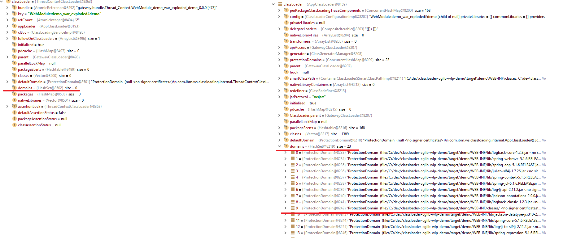

Investigation walkthrough for an issue related to multiple `classloaders` available when `SpringBoot` application is deployed on `IBM WebSphere Liberty` (`WSL`).

<!-- end -->

## Motivation

Recently I was investigating a strange issue that was present only in a production-like environment. Fortunately, my team have CI which is almost 1 to 1 with production so we were able to catch this issue before deployment. So what's different between production and local environment you may ask. Well, the answer is very simple - we use different servlet containers. For local development, we use embedded `Tomcat` web server that is ship together with `SpringBoot`. On production, we have `WSL` application server. Because I wanted to know why the issue was happening only on one environment and working perfectly fine on another I had to dig a little bit. 

## Context

Before moving forward with the analyze let's give some context so that what I will write next will have more sense. As always it starts with a **simple** task in Jira backlog. The task was to move complex **authorization** mechanism from service to web layer. 

> authorization is the process of verifying that "you are permitted to do what you are trying to do"

> source: Wikipedia

The difference on performing **authorization** on these two layers is that services operate on actual objects where web controllers on identifiers of these objects. Below is pseudo code for the change that was planed.

Before:

```
aspect(object) {
  return allowedToAccess(object)
}
```
 
After:

```
aspect(identifier) {
  const object = resolveObjectFrom(identifier)
  return allowedToAccess(object)
}
```

For now, we know what needs to be done and how. But one more important addition to the context is about convention\* we try to follow in our code base - which is - extensive usage of encapsulation which in our case is more about creating a clear interface for others who will be using these objects than just hiding information.

\* clarification - we follow more conventions/best practices but in the context of this post, only this single convention is important.

But what this exactly mean? In simple words, we use `public` modifier only when it's really required, if not then we operate mostly using only `private` and `package protected` modifiers. I think the above context should be enough to start analyzing a concrete example. To make analyze simpler I have created a sample application demonstrate a problem and can be found on [github](https://github.com/ajurasz/wlp-spring-aop). 

## Analyze

### Posotive scenario

For our case, we need to focus only on three elements.

1. `HelloControler` this is standard `RestController` to which one dependency is injected.

```java
@RestController
class HelloController {
    private final HelloService helloService;

    HelloController(HelloService helloService) {
        this.helloService = helloService;
    }

    @GetMapping("/hello/{name}")
    ResponseEntity<String> hello(@PathVariable("name") String name) {
        return ResponseEntity.ok(helloService.sayHello(name));
    }
}
```

2. `PointcutedHelloController` is special because `PointcutedHelloController#hello` is join point for around advice ([AOP terminology](https://docs.spring.io/spring/docs/current/spring-framework-reference/core.html#aop))

```java
@RestController
class PointcutedHelloController {
    private final HelloService helloService;

    PointcutedHelloController(HelloService helloService) {
        this.helloService = helloService;
    }

    @GetMapping("/hello-aop/{name}")
    ResponseEntity<String> hello(@PathVariable("name") String name) {
        return ResponseEntity.ok(helloService.sayHello(name));
    }
}
```

3. `LoggingAspect` which registers advice around specified pointcut

```java
@Aspect
@Component
class LoggingAspect {
    private static final Logger LOG = LoggerFactory.getLogger(LoggingAspect.class);

    @Around("within(com.example.demo.PointcutedHelloController)")
    Object aroud(ProceedingJoinPoint pjp) throws Throwable {
        LOG.info(pjp.getSignature().toLongString());
        return pjp.proceed();
    }
}
```


You can run tests or application itself (`mvn spring-boot:run`) and call `hello` methods - everything will work as expected. Please notice, if you will place `breakpoint` in `PointcutedHelloController#hello` you will see that `PointcutedHelloController` is wrapped with `com.example.demo.PointcutedHelloController$$EnhancerBySpringCGLIB` proxy.

### Negative scenario

First you will have to change profile setting `activeByDefault` from `false` to `true` in `pom.xml` so it looks like this:

```xml
<id>wlp</id>
<activation>
    <activeByDefault>true</activeByDefault>
</activation>
```


then you just need to build `war` package (`mvn clean package -DskipTest`) and deploy it to `WSL`. After starting the server it crashes with the following message:

```bash
Caused by: org.springframework.aop.framework.AopConfigException: Could not generate CGLIB subclass of class com.example.demo.PointcutedHelloController: Common causes of this problem include using a final class or a non-visible class; nested exception is org.springframework.cglib.core.CodeGenerationException: java.lang.IllegalAccessError-->class com.example.demo.PointcutedHelloController$$EnhancerBySpringCGLIB$$4f0e109d cannot access its superclass com.example.demo.PointcutedHelloController
    at org.springframework.aop.framework.CglibAopProxy.getProxy(CglibAopProxy.java:208) ~[spring-aop-5.1.6.RELEASE.jar:5.1.6.RELEASE]
    at org.springframework.aop.framework.ProxyFactory.getProxy(ProxyFactory.java:110) ~[spring-aop-5.1.6.RELEASE.jar:5.1.6.RELEASE]
    at org.springframework.aop.framework.autoproxy.AbstractAutoProxyCreator.createProxy(AbstractAutoProxyCreator.java:471) ~[spring-aop-5.1.6.RELEASE.jar:5.1.6.RELEASE]
    at org.springframework.aop.framework.autoproxy.AbstractAutoProxyCreator.wrapIfNecessary(AbstractAutoProxyCreator.java:350) ~[spring-aop-5.1.6.RELEASE.jar:5.1.6.RELEASE]
    at org.springframework.aop.framework.autoproxy.AbstractAutoProxyCreator.postProcessAfterInitialization(AbstractAutoProxyCreator.java:299) ~[spring-aop-5.1.6.RELEASE.jar:5.1.6.RELEASE]
    at org.springframework.beans.factory.support.AbstractAutowireCapableBeanFactory.applyBeanPostProcessorsAfterInitialization(AbstractAutowireCapableBeanFactory.java:429) ~[spring-beans-5.1.6.RELEASE.jar:5.1.6.RELEASE]
    at org.springframework.beans.factory.support.AbstractAutowireCapableBeanFactory.initializeBean(AbstractAutowireCapableBeanFactory.java:1782) ~[spring-beans-5.1.6.RELEASE.jar:5.1.6.RELEASE]
    at org.springframework.beans.factory.support.AbstractAutowireCapableBeanFactory.doCreateBean(AbstractAutowireCapableBeanFactory.java:593) ~[spring-beans-5.1.6.RELEASE.jar:5.1.6.RELEASE]
    ... 32 common frames omitted
Caused by: org.springframework.cglib.core.CodeGenerationException: java.lang.IllegalAccessError-->class com.example.demo.PointcutedHelloController$$EnhancerBySpringCGLIB$$4f0e109d cannot access its superclass com.example.demo.PointcutedHelloController
    at org.springframework.cglib.core.ReflectUtils.defineClass(ReflectUtils.java:530) ~[spring-core-5.1.6.RELEASE.jar:5.1.6.RELEASE]
    at org.springframework.cglib.core.AbstractClassGenerator.generate(AbstractClassGenerator.java:363) ~[spring-core-5.1.6.RELEASE.jar:5.1.6.RELEASE]
    at org.springframework.cglib.proxy.Enhancer.generate(Enhancer.java:582) ~[spring-core-5.1.6.RELEASE.jar:5.1.6.RELEASE]
    at org.springframework.cglib.core.AbstractClassGenerator$ClassLoaderData$3.apply(AbstractClassGenerator.java:110) ~[spring-core-5.1.6.RELEASE.jar:5.1.6.RELEASE]
    at org.springframework.cglib.core.AbstractClassGenerator$ClassLoaderData$3.apply(AbstractClassGenerator.java:108) ~[spring-core-5.1.6.RELEASE.jar:5.1.6.RELEASE]
    at org.springframework.cglib.core.internal.LoadingCache$2.call(LoadingCache.java:54) ~[spring-core-5.1.6.RELEASE.jar:5.1.6.RELEASE]
    at java.util.concurrent.FutureTask.run$$$capture(FutureTask.java:266) [na:1.8.0_201]
    at java.util.concurrent.FutureTask.run(FutureTask.java) [na:1.8.0_201]
    at org.springframework.cglib.core.internal.LoadingCache.createEntry(LoadingCache.java:61) ~[spring-core-5.1.6.RELEASE.jar:5.1.6.RELEASE]
    at org.springframework.cglib.core.internal.LoadingCache.get(LoadingCache.java:34) ~[spring-core-5.1.6.RELEASE.jar:5.1.6.RELEASE]
    at org.springframework.cglib.core.AbstractClassGenerator$ClassLoaderData.get(AbstractClassGenerator.java:134) ~[spring-core-5.1.6.RELEASE.jar:5.1.6.RELEASE]
    at org.springframework.cglib.core.AbstractClassGenerator.create(AbstractClassGenerator.java:319) ~[spring-core-5.1.6.RELEASE.jar:5.1.6.RELEASE]
    at org.springframework.cglib.proxy.Enhancer.createHelper(Enhancer.java:569) ~[spring-core-5.1.6.RELEASE.jar:5.1.6.RELEASE]
    at org.springframework.cglib.proxy.Enhancer.createClass(Enhancer.java:416) ~[spring-core-5.1.6.RELEASE.jar:5.1.6.RELEASE]
    at org.springframework.aop.framework.ObjenesisCglibAopProxy.createProxyClassAndInstance(ObjenesisCglibAopProxy.java:57) ~[spring-aop-5.1.6.RELEASE.jar:5.1.6.RELEASE]
    at org.springframework.aop.framework.CglibAopProxy.getProxy(CglibAopProxy.java:205) ~[spring-aop-5.1.6.RELEASE.jar:5.1.6.RELEASE]
    ... 39 common frames omitted
Caused by: java.lang.IllegalAccessError: class com.example.demo.PointcutedHelloController$$EnhancerBySpringCGLIB$$4f0e109d cannot access its superclass com.example.demo.PointcutedHelloController
    at java.lang.ClassLoader.defineClass1(Native Method) ~[na:1.8.0_201]
    at java.lang.ClassLoader.defineClass(ClassLoader.java:763) ~[na:1.8.0_201]
    at sun.reflect.GeneratedMethodAccessor27.invoke(Unknown Source) ~[na:na]
    at sun.reflect.DelegatingMethodAccessorImpl.invoke(DelegatingMethodAccessorImpl.java:43) ~[na:1.8.0_201]
    at java.lang.reflect.Method.invoke(Method.java:498) ~[na:1.8.0_201]
    at org.springframework.cglib.core.ReflectUtils.defineClass(ReflectUtils.java:527) ~[spring-core-5.1.6.RELEASE.jar:5.1.6.RELEASE]
    ... 54 common frames omitted
```

First thing that caught my attention was `Could not generate CGLIB subclass of ...: Common causes of this problem include using a final class or a non-visible class` which seems to be fair enough as controller class is not public so it can be non-visible but then next question arises - why this was working locally when deployed on `Tomcat`? At this point removing AOP advice from `PointcutedHelloController#hello` metod, fix the problem. This clearly indicates that there is something wrong when using `Spring AOP`. Maybe it requires classes and method to be public? Let's see what [documentation](https://docs.spring.io/spring/docs/current/spring-framework-reference/core.html#aop-introduction-proxies) says about it. Most important fragment of this documentation to my current situation is:

> With CGLIB, public and protected method calls on the proxy are intercepted (and even package-visible methods, if necessary).

And this is true when deploying on `Tomcat` but not when on `WSL`. Because I'm not a `WSL` expert I had to do some googling to find out that this issue can be related to `classloader`s. Where one `classloader` is used to load all 3rd party libraries from `/WEB-INF/lib` and my own classes from `/WEB-INF/classes` and another when creating proxy for `PointcutedHelloController`.  

After debugging session I was able to nail down which `classloader` is used when creating proxy.

`Spring AOP` creates its proxies through `CglibAopProxy#getProxy(classLoader)`. This `ClassLoader` object in the end is provided by `DefaultResourceLoader` which sets `classLoader` to `Thread.currentThread().getContextClassLoader()` during object construction. Bellow is screenshot which shows how `classLoader` provided by `DefaultResourceLoader` (left) differs from `classLoader` awaible in any other place of my application when calling `getClass().getClassLoader()`



It looks like the one created by `DefaultResourceLoader` is not aware of my classes so that's the reason why application crashes on startup.

### Fix

We know that everything starts in `DefaultResourceLoader` so we can register our custom `ServletContextInitializer` to override default `classLoader` created by `DefaultResourceLoader`. This can be done by extending `SpringBootServletInitializer` class like so:

```java
@SpringBootApplication
public class DemoApplication extends SpringBootServletInitializer
{

    public static void main(String[] args) {
        SpringApplication.run(DemoApplication.class, args);
    }

    @Override
    protected SpringApplicationBuilder configure(SpringApplicationBuilder applicationBuilder) {
        return applicationBuilder.sources(DemoApplication.class)
                .initializers(configurableApplicationContext -> {
                    ClassLoader classLoader = getClass().getClassLoader();
                    ((DefaultResourceLoader)configurableApplicationContext).setClassLoader(classLoader);
                });
    }
}
```

It is possible becouse `configurableApplicationContext` is instance of `AnnotationConfigServletWebServerApplicationContext` class which in turn is subclass of `DefaultResourceLoader`.
