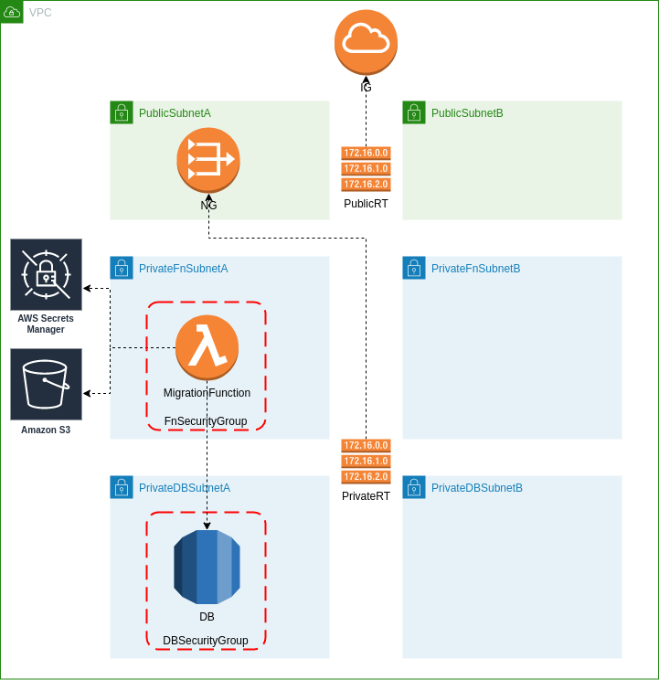

Looking on some of the AWS efforts around RDS service it won't be an incorrect statement to say that they want to bring the world of relational databases closer to Lambda functions. First, [Aurora Serverless](https://aws.amazon.com/rds/aurora/serverless/) was [announced](https://aws.amazon.com/blogs/aws/aurora-serverless-ga/) then less than a year later this revolutionary service was extended by [Data API](https://aws.amazon.com/blogs/aws/new-data-api-for-amazon-aurora-serverless/) where interaction with DB is done through API endpoint. But this is not an end, the next year has come and we got [RDS proxy](https://aws.amazon.com/blogs/aws/amazon-rds-proxy-now-generally-available/) whose main task is to help improve applications scalability by managing DB connections.

<!-- end -->

All these improvements show us that relational databases are relevant for serverless applications otherwise AWS wouldn't put such a big effort in helping developers writing more efficient Lambda functions while working with RDS service.

The main purpose of this introduction was to defend the topic of this blog post - **managing schema evolution in the serverless stack** - which I hope doesn't sound too abstract now. As befits a Java developer I could not resist bringing my own toolset to face the issue. The toolset consists of Java 11, Maven and Flyway.

## CloudFormation

Let's say that on the design level it was decided that the relational database will be best suited for the job. The first thing that arises is how can we initialize the RDS database with initial schema and then manage the evolution of that schema when all we have are just single-purpose functions containing business logic. There are multiple approaches to tackle this issue, [here](https://stackoverflow.com/questions/14384849/is-there-a-way-to-run-initial-sql-when-creating-an-rds-database-instance-using-c) you will find some interesting suggestions. I decided to take advantage of CloudFormation(CF) [Custom Resources](https://docs.aws.amazon.com/AWSCloudFormation/latest/UserGuide/template-custom-resources.html). This has some limitation which will be mentioned later on - but do not worry I will also show how to overcome them.

My main goal was to set up a single-click deployment solution so that anyone could try and run this on his own AWS account. Since I will be using CF this will be not an issue. Furthermore, the main resource will be a Lambda function, in this case, it's advisable to use AWS Serverless Application Model (AWS SAM) a template specification which provides a simple and clean way of describing Lambda functions (together with API endpoints if needed). But the specification is not all, we additionally get the utility tool ([SAM CLI](https://docs.aws.amazon.com/serverless-application-model/latest/developerguide/what-is-sam.html)) which brings building, testing and deploying Lambda functions to the next level.  

## Custom Resource

While new services are introduced on AWS they not always are immediately supported in CF, for this reason, Custom Resources where created which brings back doors to AWS API so that it's possible to interact with these new services through code. Custom Resources can be also used to provide side effects like cleanup s3 bucket while removing a stack or run schema migration against DB like it will be in our case. Defining Custom Resource is very simple, we only need to provide `ServiceToken` which points to Lambda function or SNS topic:

```yml
Resources:
  LambdaMigrationFunctionTrigger:
    Type: Custom::LambdaMigrationFunctionTrigger
    Properties:
      ServiceToken: !GetAtt MigrationFunction.Arn
```

Base on this information CF sends [request object](https://docs.aws.amazon.com/AWSCloudFormation/latest/UserGuide/crpg-ref-requests.html) any time when this resource is created, updated or deleted. 

```json
{
   "RequestType" : "Create",
   "ResponseURL" : "http://pre-signed-S3-url-for-response",
   "StackId" : "arn:aws:cloudformation:us-west-2:123456789012:stack/stack-name/guid",
   "RequestId" : "unique id for this create request",
   "ResourceType" : "Custom::TestResource",
   "LogicalResourceId" : "MyTestResource",
   "ResourceProperties" : {
      "Name" : "Value",
      "List" : [ "1", "2", "3" ]
   }
}
```

Whenever CF stack is created or delete a request will be sent to target service, but to trigger an update request one of Custome Resource property needs to be updated. For our case, this is very important because most of the time Custom Resource should be triggered while updating Lambda function with new migration scripts. This limitation can be overcome by introducing a fake property (`DeployTimestamp`) which the only purpose will be to hold different value whenever CF stack is updated.

```yml
Parameters:
  DeployTimestamp:
    Type: Number
    Default: 0
Resources:
  LambdaMigrationFunctionTrigger:
    Type: Custom::LambdaMigrationFunctionTrigger
    Properties:
      ServiceToken: !GetAtt MigrationFunction.Arn
      DeployTimestamp: !Ref DeployTimestamp
```

Value of this property won't change out of the box but can be easily overridden while uploading template from CLI

```bash
# AWS CLI
aws cloudformation package --template-file $TEMPLATE --s3-bucket $AWS_S3_BUCKET --output-template-file out.yml
aws cloudformation deploy --template-file out.yml --stack-name $STACK_NAME --capabilities CAPABILITY_IAM --parameter-overrides DeployTimestamp=$(date +%s)

# SAM CLI 
sam deploy --stack-name $STACK_NAME --capabilities CAPABILITY_IAM --parameter-overrides DeployTimestamp=$(date +%s)
```

Now CF will send update requests to Lambda function every time the CF stack if updated.

## Architecture



The sample architecture was prepared with an emphasis on security best practices for DBs running in the AWS cloud. 
- DB instance is running in private subnet without ingress traffic from the internet. 
- Restricted security group is assigned to this instance which allows only access from `FnSecurityGroup` source which in turn is associated with our Lambda function (`MigrationFunction`). 
- DB credentials are stored in [AWS Secrets Manager](https://aws.amazon.com/secrets-manager/), this way there is no need to pass sensitive data directly to Lambda function. 
- Execution role associated with Lambda function allows it to fetch DB credentials.

Because RDS is running in private subnet without internet access, Lambda function had to be deployed within VPC. One of the Lambda function characteristics is that it cannot have a public IP address - to meet this requirements Lambda function needs to be deployed in a private subnet.
So how can we provide internet access for functions that need to be run in VPC? There are two options, set up a NAT Gateway or create VPC Endpoint for every service you need to communicate with. As shown in the above diagram we will use the first option.

## Deployment

It's finally time to get our hands dirty and run some code. First of all clone [repository](https://github.com/ajurasz/flyless)

```bash
git clone https://github.com/ajurasz/flyless.git
```

> **NOTICE:** See [Prerequisites](https://github.com/ajurasz/flyless#prerequisites) section in readme file.

then run

```bash
./deploy.sh
```

> **NOTICE:** While running script it's expected that AWS CLI was configured.

Few interesting things are happening inside this script.

### Building

```
sam build
```

will build our maven project and run integration tests. These tests run schema migration against **real DB** - same version that will be used in AWS - all of this was done with the help of [Testcontainers](https://www.testcontainers.org/). With this library test code can be as easy and clean as:

```java
@Testcontainers
@ExtendWith(MockitoExtension.class)
class MigrationHandlerIT {
    @Container
    private MySQLContainer mysql = new MySQLContainer(DockerImageName.parse("mysql:5.7.31"))
            .withDatabaseName(System.getenv("RDS_DB_NAME"))
            .withUsername(System.getenv("RDS_USERNAME"))
            .withPassword(System.getenv("RDS_PASSWORD"));

    @Mock
    private CfnResponse cfnResponse;

    @BeforeEach
    void setUp() {
        EnvironmentVariables.getenv().put("RDS_PORT", "" + mysql.getFirstMappedPort());
    }

    @Test
    @DisplayName("should run all migration scripts")
    void test() {
        // given
        var migrationHandler = new MigrationHandler(cfnResponse);
        var input = Map.<String, Object>of(
                "RequestType", "Create",
                "RequestId", "RequestId",
                "ResponseURL", "http://pre-signed-S3-url-for-response",
                "StackId", "arn:aws:cloudformation:us-east-1:123456789012:stack/MyStack/guid",
                "LogicalResourceId", "MyTestResource");

        // when
        var response = migrationHandler.handleRequest(input, new DummyContext());

        // then
        Assert.assertEquals(3, (int) response);
        verify(cfnResponse).send(eq(SUCCESS), any(CfnEvent.class), any(Context.class));
    }
}
```

Environment variables used in the test were setup through `maven-failsafe-plugin`

```xml
<plugin>
    <artifactId>maven-failsafe-plugin</artifactId>
    <version>2.22.2</version>
    <configuration>
        <environmentVariables>
            <RDS_DB_NAME>db_name</RDS_DB_NAME>
            <RDS_USERNAME>user</RDS_USERNAME>
            <RDS_PASSWORD>password</RDS_PASSWORD>
            <RDS_HOST>localhost</RDS_HOST>
            <DB_STAGE>test</DB_STAGE>
            <AWS_SAM_LOCAL>true</AWS_SAM_LOCAL>
        </environmentVariables>
    </configuration>
    <executions>
        <execution>
            <id>integration-test</id>
            <goals>
                <goal>integration-test</goal>
                <goal>verify</goal>
            </goals>
        </execution>
    </executions>
</plugin>
```

Tests can be also run independently without SAM CLI

```bash
mvn -f MigrationFunction/pom.xml clean verify
```

### Imitating AWS Lambda service

When I wrote that SAM CLI brings testing to the next level, here is why. There is a possibility to invoke function locally with 

```bash
sam local invoke
```

Under the hood SAM CLI setup infrastructure using docker containers that imitate AWS then it deploys our code to that infrastructure and finally executes that code. To run the migration function which depends on an external database all needed containers needs to be run under a single network.

```bash
docker network create --driver bridge sam_flyless_newtork
docker run --rm -d --name sam_flyless_mysql --network sam_flyless_newtork -e MYSQL_RANDOM_ROOT_PASSWORD=yes -e MYSQL_DATABASE=$DB_NAME -e MYSQL_USER=$DB_USERNAME -e MYSQL_PASSWORD=$DB_PASSWORD mysql:5.7.31

sam local invoke --event events/create_event.json --docker-network sam_flyless_newtork --env-vars env.json
```
This way Lambda function will have direct access to DB container prepared in advance. 
To have better control over what event will trigger the function or which environment variables will be available in the runtime following options can be specified `--event` (path to JSON file containing an event) and  `--env-vars` (path to JSON file containing environment variables available for the Lambda function).

> **NOTICE:** While passing environment variables through `--env-vars` option, only these that are expected by the function will be passed to the environment - others will be ignored.


## Demo


## Cleanup

CF stack can be removed with ease with a single command

```bash
aws cloudformation delete-stack --stack-name $STACK_NAME
```

As mentioned before, while CF stack is deleted a delete request is sent to the target service and CF expect to receive a response. To provide Lamdba function possibility to respond to CF, NAT Gateway needs to stay operational. We can ensure that all required resources will not be deleted until it's still needed by Lambda function with [DependsOn](https://docs.aws.amazon.com/AWSCloudFormation/latest/UserGuide/aws-attribute-dependson.html) attribute - which helps to explicitly mark dependencies between resources.

```yml
Resources:
  MigrationFunction:
    Type: AWS::Serverless::Function
    DependsOn:
      - DB
      - PublicRTAssociation1
      - PublicRTAssociation2
      - PublicRTRouteToInternet
      - PrivateRTAssociation3
      - PrivateRTAssociation4
      - PrivateRTRouteToNG
      - IGAttachment
```

## Conclusion

While working with relational databases in the serverless stack I don't see any disadvantage of maintaining schema evolution in the way it was described. I just want to alert you to a fact that we must remember - execution time of Lambda function can be up to 15 min, so if you expect that your migration could take longer then you should think about a different approach.