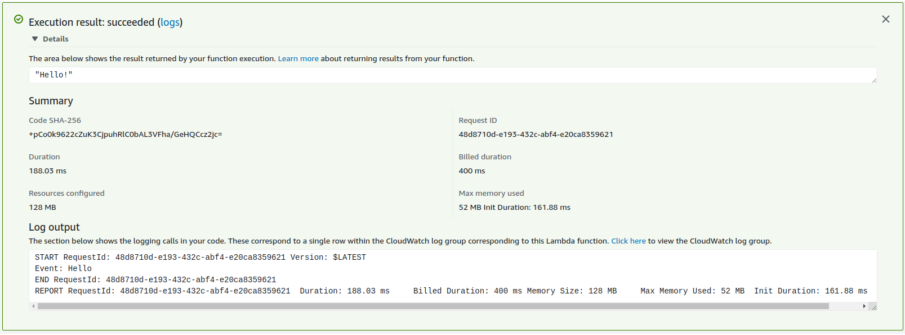

AWS Lambda support many [build in runtimes](https://docs.aws.amazon.com/lambda/latest/dg/lambda-runtimes.html). But we also have a possibility to create custom runtimes to run functions in a language that is not yet supported by Lambda service or when we need to do some extra optimization (i.e. reduce startup time or memory footprint of functions build for JVM). Today we will learn how to build a very simple runtime focusing mainly on steps required to do so.

<!-- end -->

## Custom runtime

Every runtime is executed on Amazon Linux or Amazon Linux 2 operating system. In case of JVM, functions need at least a Java Runtime Environment (JRE) to run a `jar` but it won't be available out of the box on mentioned systems. Thankfully starting from Java 9 a `jlink` tool was introduced which creates a customized JRE that contains only these modules that are required by your own module - this way JRE can be part of the deployment package.

To create a runtime we need a `bootstrap` file to be present in the root of a deployment package. This file is an entry point for the custom runtime and will be called by Lambda as part of `init` phase.


> Source: https://docs.aws.amazon.com/lambda/latest/dg/runtimes-context.html

## Deployment package

So far we know that custom runtime will require a `bootstrap` file and custom JRE. Since we will be working with ([SAM CLI](https://docs.aws.amazon.com/serverless-application-model/latest/developerguide/what-is-sam.html)) we can use the possibility to customize `build` command. This can be done by providing `Metadata` resource attribute with a `BuildMethod: makefile` entry


```yml
Resources:
  NaiveJavaRuntimeFunction:
    Type: AWS::Serverless::Function
    Properties:
      CodeUri: NaiveJavaRuntime
      Handler: do.not.apply
      Runtime: provided
      MemorySize: 128
    Metadata:
      BuildMethod: makefile
```

By convention `sam build` will look for `build-NaiveJavaRuntimeFunction` target in a `Makefile`. 

```
build-NaiveJavaRuntimeFunction:
  @ mvn clean package
  @ chmod +x ./target/classes/bootstrap
  @ cp -rf ./target/classes/bootstrap $(ARTIFACTS_DIR)
  @ jlink --module-path ./target/naive-java-runtime.jar:$(JAVA_HOME)/jmods \
         --add-modules  naive.java.runtime \
         --output ./target/dist \
         --launcher executable=naive.java.runtime/io.github.ajurasz.naivejavaruntime.Bootstrap \
         --compress 2 --no-header-files --no-man-pages --strip-debug
  @ cp -rf ./target/dist $(ARTIFACTS_DIR)
```

Here's what is happening:

1) Build package using maven
2) Change `bootstrap` file permission
3) Copy `bootstrap` file (which is part of project resources) to `ARTIFACTS_DIR`
4) Build custom JRE. Notice `--launcher` option which will create an executable file (`dist/bin/executable`) which when called will run the main method
5) Copy output created by `jlink` to `ARTIFACTS_DIR`

At the end `ARTIFACTS_DIR` will look like this:

```shell
.
├── bootstrap
└── dist
    ├── bin
    │   ├── executable
    │   ├── java
    │   └── keytool
    ├── conf
    │   ├── net.properties
    │   └── security
    ├── legal
    │   ├── java.base
    │   └── java.net.http
    ├── lib
    │   ├── classlist
    │   ├── jexec
    │   ├── jli
    │   ├── jrt-fs.jar
    │   ├── jspawnhelper
    │   ├── jvm.cfg
    │   ├── libjava.so
    │   ├── libjimage.so
    │   ├── libjsig.so
    │   ├── libnet.so
    │   ├── libnio.so
    │   ├── libverify.so
    │   ├── libzip.so
    │   ├── modules
    │   ├── security
    │   ├── server
    │   └── tzdb.dat
    └── release
```

When the function was deployed we can give it a try in Lambda console.


## Runtime

Beside initialization, custom runtime is also responsible for [processing tasks](https://docs.aws.amazon.com/lambda/latest/dg/runtimes-custom.html#runtimes-custom-build) consisting of:

1) Getting an event
2) Propagating the tracing header
3) Creating a context object
4) Invoking the function handler
5) Handling the response
6) Handling errors
7) Cleanup

My naive implementation meets just three of these tasks. To support all of them it would require much more development and then the maintenance of that code. But there is a better alternative to reinventing the wheel - taking advantage of very impressive [Quarkus module](https://quarkus.io/guides/funqy-amazon-lambda). Except that it provides an implementation for all processing tasks it also gives the possibility to build a native image which additionally lower memory footprint and accelerates initialization times. All this can be done with small adjustments to [pom.xml](https://github.com/ajurasz/lambda-custom-runtime/blob/master/FunqyAmazonLambda/pom.xml). 

When the function was deployed we can give it a try in Lambda console.



Please notice time difference between these two functions - native executable is 11 times faster and if it comes to deployment package size it's 30% smaller (24 MB instead of 34 MB).
