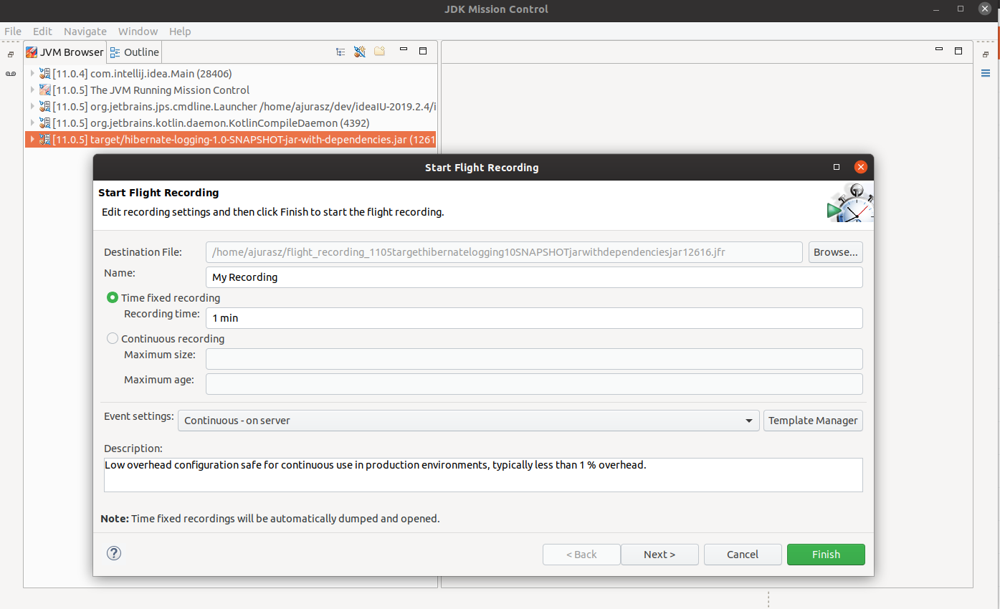
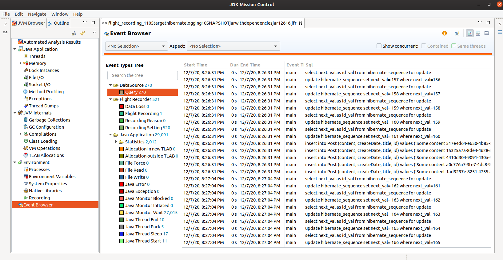

Since Java 11, `JDK Flight Recorder` (`JFR`) is getting more and more popular among developers. There are two reasons behind this fact, first, `JFR` got open-sourced and included into OpenJDK - previously it was part of a `JRockit JVM` and commercial version of Oracle JDK (see [JEP 328](http://openjdk.java.net/jeps/328) for more details.). The second fact is that it is a tool for collecting diagnostic and profiling data about running Java application - because it is so deeply embedded to JVM it provides extremely low overhead (about 1% out of the box).

<!-- end -->

## Low overhead

To get a very good and affordable explanation on how JVM engineers managed to achieve so great results, please watch part of the following video where Mikael Vidstedt explains this.

<iframe width="560" height="315" src="https://www.youtube.com/embed/plYESjZ12hM?t=1" frameborder="0" allow="accelerometer; autoplay; clipboard-write; encrypted-media; gyroscope; picture-in-picture" allowfullscreen></iframe>

> I encourage you to watch the full presentation as it is very enlightening in terms of `JFR` topic.

## JFR

If videos are not your thing and you prefer to read then I recommend following blog posts from `redhat`:

- [Get started with JDK Flight Recorder in OpenJDK 8u](https://developers.redhat.com/blog/2020/08/25/get-started-with-jdk-flight-recorder-in-openjdk-8u/)
- [Collect JDK Flight Recorder events at runtime with JMC Agent](https://developers.redhat.com/blog/2020/10/29/collect-jdk-flight-recorder-events-at-runtime-with-jmc-agent/)

## Motivation

I got inspired by Gunnar Morling and his tweet

https://twitter.com/gunnarmorling/status/1317552923950391301

Although it's not visible on the Gunnar's screen if he logs SQL statements together with parameters I thought it would be a great exercise to see if I could do the similar thing using `JFR` and have full SQL statements that can be copy-pasted to an SQL editor.

## Datasource proxy

First, to be able to get access to SQL statements and parameters passed to JDBC it would be required to intercept appropriate methods from JDBC API through a proxy around `java.sql.Statement`. To make things easier and focus mostly on creating `jdk.jfr.Event`s we will use [datasource-proxy](https://github.com/ttddyy/datasource-proxy) - library which gives easy access to what is needed.

Let's start wit creating `javax.sql.DataSource` and tell HIbernate to use it.

```kotlin
object DB {
    private val sessionFactory: SessionFactory

    init {
        val registry = StandardServiceRegistryBuilder()
                .configure()
                .applySettings(runtimeSettings())
                .build()

        sessionFactory = MetadataSources(registry)
                .addAnnotatedClass(Post::class.java)
                .buildMetadata()
                .buildSessionFactory()
    }

    private fun runtimeSettings(): MutableMap<String, Any> {
        return mutableMapOf(
                Environment.DATASOURCE to dataSourceProxy()
        )
    }

    private fun dataSourceProxy() = ProxyDataSourceBuilder.create(dataSource())
            .listener(QueryRecorder())
            .build()

    private fun dataSource() = MysqlDataSource().also {
        it.setURL(dbUrl())
        it.user = dbUser()
        it.password = dbPassword()
    }

    // rest of the code omitted for better readability    
}
```

> Hibernate is used only to make this example more interesting. It would be possible to use raw JDBC API and work directly with `java.sql.Connection` and `java.sql.PreparedStatement`.

Notice that `ProxyDataSourceBuilder` register `QueryRecorder` listener that will be executed after a call to one of the following methods `executeQuery, executeUpdate, execute, executeLargeUpdate` from `java.sql.Statement`. `QueryRecorder#afterQuery` is responsible for parsing provided arguments through the `Query` object and then commit `JFR` events.

```kotlin
class QueryRecorder : QueryExecutionListener by QueryExecutionListener.DEFAULT {
    override fun afterQuery(execInfo: ExecutionInfo?, queryInfoList: MutableList<QueryInfo>) {
        resolveQuery(queryInfoList)
                .forEach(::publishEvent)
    }

    private fun resolveQuery(queryInfoList: MutableList<QueryInfo>) = queryInfoList
            .flatMap { it.parametersList.map { params -> Pair(it.query, params) } }
            .map { (query, params) -> Query.from(query, params) }

    private fun publishEvent(query: Query) = QueryEvent(query.toSql()).commit()
}
```

## Collecting JFR events

There are three ways to "record flights".

1) JDK Mission Control (JMC)

The main purpose of this tool is to analyze `JFR` recordings through a graphical interface. Beside displaying these data it can interact with `JFR` to start recordings. Assuming there is a running Java application supporting `JFR`, then we can select process under which this application runs and start recording as shown below.





There are two important things to be aware of while configuring recording (this applies to other two ways as well). First is that there are two types of recordings `Time fixed` where we define the time of recording and `Continuous` where we define the maximum size and age of these recordings. `Time fixed` is very nice to sample your Java application once for a given time and then when recording is finished `JMC` will automatically load and display collected data - for `Continuous` type you would have to manually dump recordings to a file and then load them in `JMC`.




> **SQL statements provided by JFR Events**

> select next_val as id_val from hibernate_sequence for update

> update hibernate_sequence set next_val= 6 where next_val=5

> insert into Post (content, createDate, title, id) values ('Some content 0dfbf216-4e93-46cd-8f2f-25999e7114bd', '2020-12-342 22:12:75', 'Post #1', 1)

> insert into Post (content, createDate, title, id) values ('Some content e23c1061-95f4-4960-a484-90e3483165e7', '2020-12-342 22:12:09', 'Post #2', 2)

> insert into Post (content, createDate, title, id) values ('Some content c102d6c3-a070-466f-9ff4-44cc69bb20d0', '2020-12-342 22:12:14', 'Post #3', 3)

> insert into Post (content, createDate, title, id) values ('Some content 5c7c2083-68ec-4b1d-b911-95942facddb0', '2020-12-342 22:12:19', 'Post #4', 4)

> insert into Post (content, createDate, title, id) values ('Some content a8118b5b-f3d4-4fa5-b796-01a33f79bab4', '2020-12-342 22:12:23', 'Post #5', 5)

The second important thing I mentioned that it is worth to notice is that we can define `Event settings` - file which allows customizing what events are record and how often. By default, OpenJDK 11 provides two setting files

```bash
jdk11
  ├── bin
  ├── conf
  ├── demo
  ├── include
  ├── jmods
  ├── legal
  ├── lib
  │   └── jfr
  │       ├── default.jfc
  │       └── profile.jfc
  ├── man
  └── release
```

**`default.jfc`** - "Low overhead configuration safe for continuous use in production environments, typically less than 1 % overhead."

**`profile.jfc`** - "Low overhead configuration for profiling, typically around 2 % overhead."

If we would like to ignore for instance `QueryEvent` from recordings we could disable it through `jfc` file like this:

```xml
<configuration>
  <!-- Rest of the file ommited for better readability -->
  <event name="io.ajurasz.QueryEvent">
    <setting name="enabled">false</setting>
  </event>
</configuration>  
```

2) JVM

It is possible to enable recording at process startup using `-XX:StartFlightRecording` JVM option. Following command will dump recordings on exit to a file named `sample.jfr`:

```bash
java -XX:StartFlightRecording=disk=true,dumponexit=true,filename=sample.jfr -jar target/hibernate-logging-1.0-SNAPSHOT-jar-with-dependencies.jar
```

Above option is so nice that it additionally prints instruction in the console on how to dump recording to a file on demand (if we don't want to wait until process exits):

```bash
➜  hibernate-jfr-logging git:(master) ✗ java -XX:StartFlightRecording=disk=true,dumponexit=true,filename=sample.jfr -jar target/hibernate-logging-1.0-SNAPSHOT-jar-with-dependencies.jar
Started recording 1. No limit specified, using maxsize=250MB as default.

Use jcmd 24288 JFR.dump name=1 to copy recording data to file.
Dec 07, 2020 9:26:23 PM org.hibernate.Version logVersion
INFO: HHH000412: Hibernate ORM core version [WORKING]
Dec 07, 2020 9:26:23 PM org.hibernate.annotations.common.reflection.java.JavaReflectionManager <clinit>
INFO: HCANN000001: Hibernate Commons Annotations {5.1.0.Final}
Dec 07, 2020 9:26:24 PM org.hibernate.dialect.Dialect <init>
...
```

3) jcmd

`jcmd` utility is used to send diagnostic command requests to the JVM. Some of the commands are designed to control `JFR` in a running process. Following commands shows how to start, dump and stop recording:

```bash
➜  hibernate-jfr-logging git:(master) jcmd 25024 JFR.start name=MyRecording
➜  hibernate-jfr-logging git:(master) jcmd 25024 JFR.dump filename=sample.jfr
➜  hibernate-jfr-logging git:(master) jcmd 25024 JFR.stop name=MyRecording
```

## Conclusion

`JFR` looks to be a great tool for troubleshooting errors occurring on production, especially that it does not require to restart already running application.

Source code of the sample application that logs full SQL statements can be found on [github](https://github.com/ajurasz/hibernate-jfr-logging).
